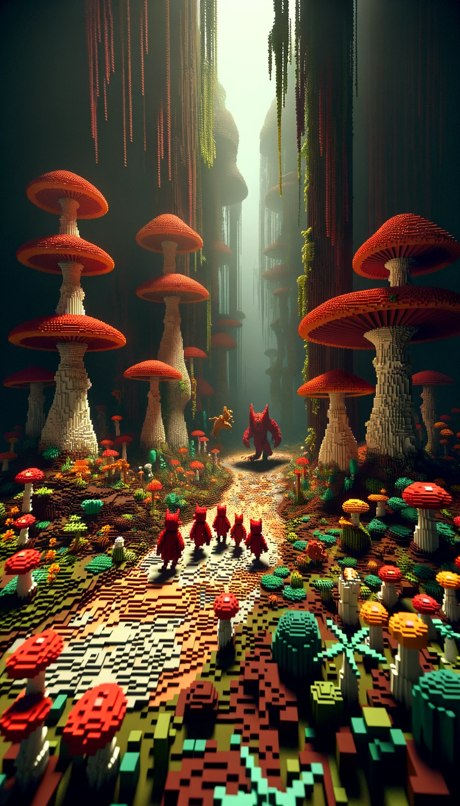
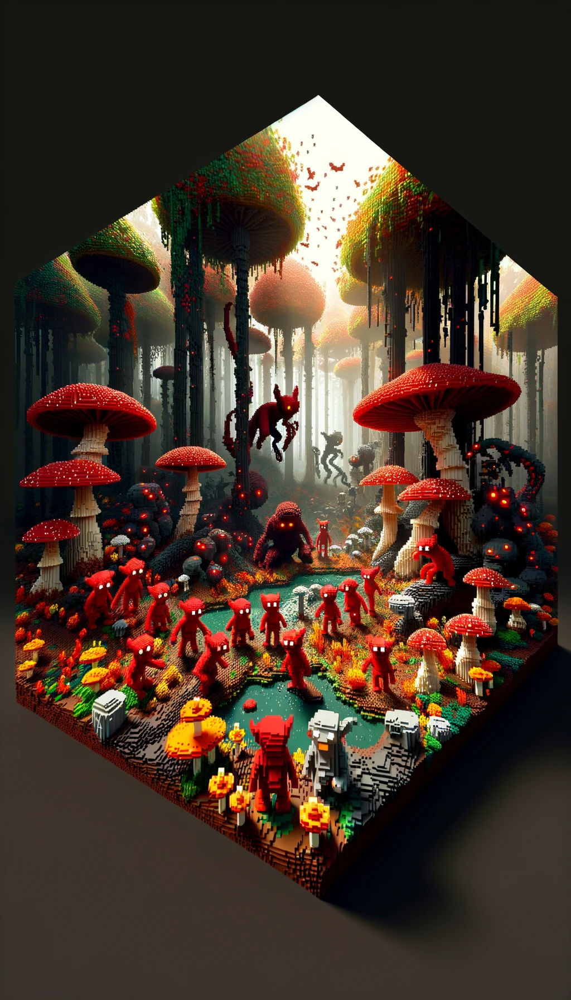
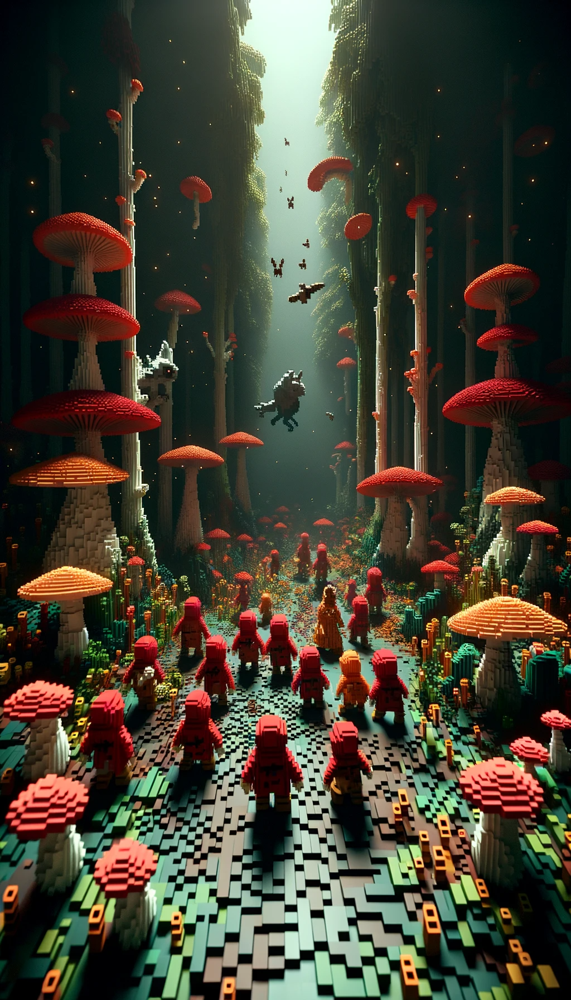
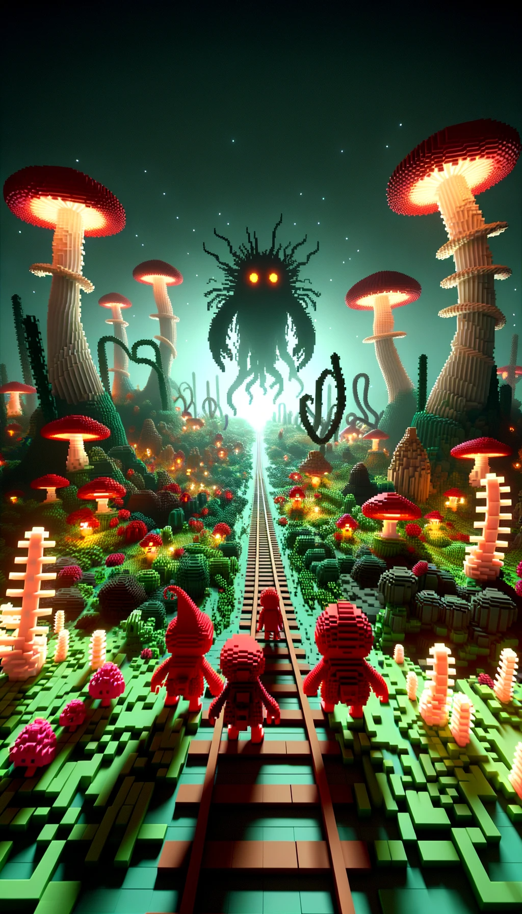
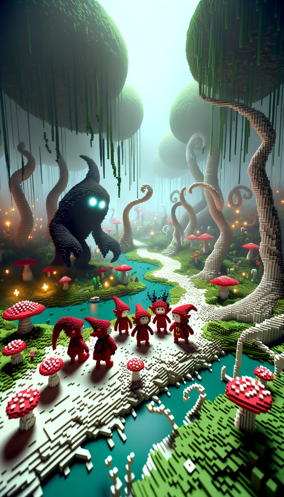
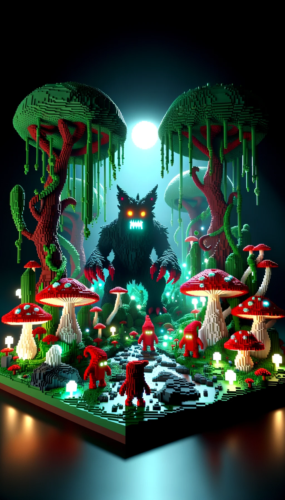

# Goblin Journey

Some globlins just trying to get home.

## First Prompt

```
Voxel Rendering |
full-length portrait
a swamp with towering mushrooms and strange flora |
A group of nomadic red goblins traveling to their village |
Dark gloomy hues with hints of vibrant warm color |
The globlin leader walk in front vigilant of danger |
Lower ranking globlins walk a lang side chatting and laughing |
A wild beast watch from the stealth shadows |
The group of wear similar clothes, each with unique attire 
```

### Dalle Generated Variants

#### 12345

> Voxel Rendering full-length portrait of a swamp setting with towering mushrooms and peculiar flora. The atmosphere is dark and gloomy but has occasional vibrant warm colors. A group of red goblins is seen traveling. The goblin leader, vigilant of potential threats, walks ahead while the other goblins walk beside each other, chatting and laughing. In the shadows, a wild creature observes them covertly. Though the goblins wear similar outfits, each has its own unique style. The view captures the whole scene, including the hidden beast.




#### 67890

> Voxel Rendering of a swamp landscape, full-length portrait. Towering mushrooms and odd flora form the backdrop. Amidst this, red goblins journey towards their village. The leader, alert and watchful, is upfront, with the others chatting animatedly. A creature hides in the shadows, watching. The goblins, while in similar clothing, showcase individual styles. The perspective is from afar, getting the entire group and the secretive beast in frame.


#### 11223

> Voxel Rendering portrait showcasing a swamp with tall mushrooms and unusual plants. Dark shades are prominent with bursts of bright warm colors. A group of red goblins is depicted. The leader leads with caution while the rest converse and laugh. A creature watches them from the shadows. Each goblin has a distinct style, though their clothing is similar. The view is panoramic, capturing the entire setting, goblins, and the lurking animal.



#### 44556

> Voxel Rendering in full-length portrait mode. The scene is a swamp filled with tall mushrooms and strange plants. The colors are primarily dark and gloomy, with splashes of warm hues. A group of red goblins makes their way through. The leader is vigilant, while others chat and jest. In the darkness, an animal spies on them. The goblins have a uniform clothing theme but with individual variations. The perspective encompasses the whole group and the hidden observer.



### Exact Prompt

#### 


3d Voxel Rendering |
Landscape full view |
a swamp (mystical glow) with towering mushrooms and strange flora (spiral vines, bizarre cactuses) |
A group of 4 nomadic red goblins traveling to return to their village |
Dark gloomy hues with hints of vibrant warm color |
Dark, gloomy hues dominate the scene but are punctuated by vibrant warm colors. |
The goblin leader walks with a keen eye out for threats, while the others seem more tense, engaged in conversation and nervously lauging. |
The leader is wearing a bright feather crown, the other globin wear gloves and hats |
A wild beast watch from the stealth shadows |
The beast is covered by glow eyes and spikey fur that radiates darkness |
All goblins wear similar clothing, but each has a unique style that sets them apart. |
The viewer observes the scene from a distance, capturing the entire front facing group and the lurking beast. 

#### 78901

> 3D Voxel Rendering of a full-view landscape. The setting is a glowing swamp filled with towering mushrooms, spiral vines, and odd cactuses. Four red goblins are making their way back to their village. The leader, distinguished by a bright feather crown, is vigilant, while the others, wearing gloves and hats, appear tense and engage in nervous chatter. A creature with glowing eyes and spiky fur emitting darkness lurks in the background. The viewpoint is distant, capturing the front-facing goblins and the hidden beast.



#### 23456

> 3D Voxel Rendering landscape showcasing a swamp with a mystical aura, dotted with tall mushrooms, twirling vines, and unique cactuses. Four red goblins journey home. The leader, with a feather crown, is alert, and the rest, adorned with gloves and hats, seem anxious, talking and laughing nervously. A shadowy creature with luminescent eyes and dark, spiky fur observes them. The perspective captures the entire scene, with goblins facing the viewer and the beast lurking.



#### 67812

> 3D Voxel Rendering of a swampy terrain glowing mystically. Amidst the landscape filled with towering mushrooms, spiral vines, and peculiar cactuses, four red goblins trek back to their village. The leader stands out with a feather crown, while the others, donning gloves and hats, converse with a sense of tension. A wild beast, characterized by its shining eyes and dark, spiky fur, watches from the shadows. The scene is captured from a distance, giving a frontal view of the goblins and the beast.


#### 34567

> 3D Voxel Rendering portraying a luminous swamp setting. Towering mushrooms, curling vines, and strange cactuses dominate the scene. Four red goblins navigate this terrain, with the leader wearing a vibrant feather crown, and the rest in gloves and hats, appearing uneasy and chatting apprehensively. A beast with glowing eyes and fur that radiates darkness hides in the backdrop. The scene is viewed from afar, presenting the goblins from the front and the concealed creature.




Complex 3d Voxel Rendering |
Landscape view |
a swamp (mystical glow) with towering mushrooms and strange flora (spiral vines, bizarre cactuses) |
Mushrooms are shaped like pinecone and other oragnic shapes. Each is a distinct color and species |
A group of 4 tall nomadic red goblins traveling to return to their village |
Dark gloomy hues with hints of vibrant warm color |
Dark, gloomy hues dominate the scene but are punctuated by vibrant warm colors. |
The goblin leader walks with a keen eye out for threats, while the others seem more tense, engaged in conversation and nervously lauging. |
The leader is wearing a long feathered crown |
The other globin wear gloves, scarves, and hats |
Some globlins are barefoot |
A wild beast watches from the stealth shadows behind a mushroom |
The beast is covered by glow eyes, has multiple wild tails, and spikey fur that radiates darkness |
All goblins wear similar clothing, but each has a unique style that sets them apart. |
The viewer observes the scene from a distance, capturing the entire front facing group and the lurking beast. 

Complex 3d Voxel Rendering |
Landscape orientation |
Panoramic view of a swamp (mystical glow) with towering mushrooms and strange flora (spiral vines, bizarre cactuses) |
A slender mood and geometric constellations shines dimly in the obscure sky |
Mushrooms are shaped like pinecone and other oragnic shapes. Each is a distinct color and species |
A group of 4 tall nomadic red goblins traveling to return to their village |
Dark gloomy hues with hints of vibrant warm color |
Dark, gloomy hues dominate the scene but are punctuated by vibrant warm colors. |
The goblin leader walks with a keen eye out for threats, while the others seem more tense, engaged in conversation and nervously lauging. |
The leader is wearing a long feathered crown |
The other globin wear gloves, scarves, and hats |
Some globlins are barefoot |
A wild beast watches from behind the group in the stealth of shadows behind a mushroom |
The beast is covered by glow eyes, has multiple wild tails, and spikey fur that radiates darkness |
All goblins wear similar clothing, but each has a unique style that sets them apart. |
The viewer observes the scene from a distance, capturing the entire front facing group and the lurking beast. 
