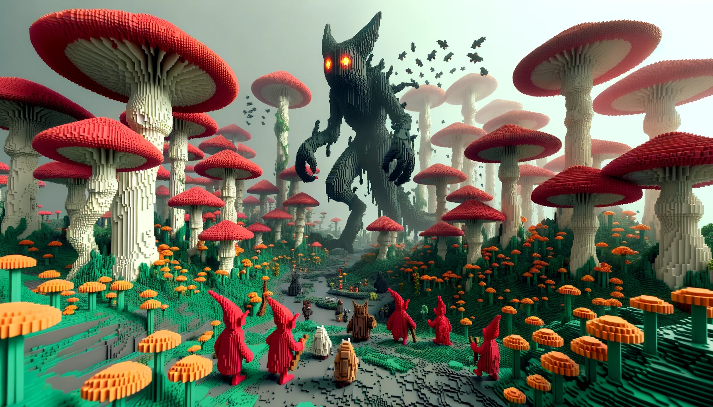

# Goblin Journey

Some globlins just trying to get home.

## First Prompt

```
Voxel Rendering |
full-length portrait
a swamp with towering mushrooms and strange flora |
A group of nomadic red goblins traveling to their village |
Dark gloomy hues with hints of vibrant warm color |
The globlin leader walk in front vigilant of danger |
Lower ranking globlins walk a lang side chatting and laughing |
A wild beast watch from the stealth shadows |
The group of wear similar clothes, each with unique attire 
```

### Dalle Generated Variants

#### 12345

> Voxel Rendering full-length portrait of a swamp setting with towering mushrooms and peculiar flora. The atmosphere is dark and gloomy but has occasional vibrant warm colors. A group of red goblins is seen traveling. The goblin leader, vigilant of potential threats, walks ahead while the other goblins walk beside each other, chatting and laughing. In the shadows, a wild creature observes them covertly. Though the goblins wear similar outfits, each has its own unique style. The view captures the whole scene, including the hidden beast.


#### 67890

> Voxel Rendering of a swamp landscape, full-length portrait. Towering mushrooms and odd flora form the backdrop. Amidst this, red goblins journey towards their village. The leader, alert and watchful, is upfront, with the others chatting animatedly. A creature hides in the shadows, watching. The goblins, while in similar clothing, showcase individual styles. The perspective is from afar, getting the entire group and the secretive beast in frame.


#### 11223

> Voxel Rendering portrait showcasing a swamp with tall mushrooms and unusual plants. Dark shades are prominent with bursts of bright warm colors. A group of red goblins is depicted. The leader leads with caution while the rest converse and laugh. A creature watches them from the shadows. Each goblin has a distinct style, though their clothing is similar. The view is panoramic, capturing the entire setting, goblins, and the lurking animal.


#### 44556

> Voxel Rendering in full-length portrait mode. The scene is a swamp filled with tall mushrooms and strange plants. The colors are primarily dark and gloomy, with splashes of warm hues. A group of red goblins makes their way through. The leader is vigilant, while others chat and jest. In the darkness, an animal spies on them. The goblins have a uniform clothing theme but with individual variations. The perspective encompasses the whole group and the hidden observer.


### 89123 (exact prompt)


## Second Prompt

```
3d Voxel Rendering |
Landscape full view |
a swamp (mystical glow) with towering mushrooms and strange flora (spiral vines, bizarre cactuses) |
A group of 4 nomadic red goblins traveling to return to their village |
Dark gloomy hues with hints of vibrant warm color |
Dark, gloomy hues dominate the scene but are punctuated by vibrant warm colors. |
The goblin leader walks with a keen eye out for threats, while the others seem more tense, engaged in conversation and nervously lauging. |
The leader is wearing a bright feather crown, the other globin wear gloves and hats |
A wild beast watch from the stealth shadows |
The beast is covered by glow eyes and spikey fur that radiates darkness |
All goblins wear similar clothing, but each has a unique style that sets them apart. |
The viewer observes the scene from a distance, capturing the entire front facing group and the lurking beast. 
```

#### 78901

> 3D Voxel Rendering of a full-view landscape. The setting is a glowing swamp filled with towering mushrooms, spiral vines, and odd cactuses. Four red goblins are making their way back to their village. The leader, distinguished by a bright feather crown, is vigilant, while the others, wearing gloves and hats, appear tense and engage in nervous chatter. A creature with glowing eyes and spiky fur emitting darkness lurks in the background. The viewpoint is distant, capturing the front-facing goblins and the hidden beast.


#### 23456

> 3D Voxel Rendering landscape showcasing a swamp with a mystical aura, dotted with tall mushrooms, twirling vines, and unique cactuses. Four red goblins journey home. The leader, with a feather crown, is alert, and the rest, adorned with gloves and hats, seem anxious, talking and laughing nervously. A shadowy creature with luminescent eyes and dark, spiky fur observes them. The perspective captures the entire scene, with goblins facing the viewer and the beast lurking.


#### 67812

> 3D Voxel Rendering of a swampy terrain glowing mystically. Amidst the landscape filled with towering mushrooms, spiral vines, and peculiar cactuses, four red goblins trek back to their village. The leader stands out with a feather crown, while the others, donning gloves and hats, converse with a sense of tension. A wild beast, characterized by its shining eyes and dark, spiky fur, watches from the shadows. The scene is captured from a distance, giving a frontal view of the goblins and the beast.


#### 34567

> 3D Voxel Rendering portraying a luminous swamp setting. Towering mushrooms, curling vines, and strange cactuses dominate the scene. Four red goblins navigate this terrain, with the leader wearing a vibrant feather crown, and the rest in gloves and hats, appearing uneasy and chatting apprehensively. A beast with glowing eyes and fur that radiates darkness hides in the backdrop. The scene is viewed from afar, presenting the goblins from the front and the concealed creature.


### 59243 (exact prompt)


### More Dalle Variant 

#### 12345

> A swamp bathed in a mystical glow with tall mushrooms and peculiar flora like spiral vines and odd cactuses. Four red goblins are on their way back to their village, with the leader wearing a distinct feather crown. The other goblins, donned in gloves and hats, chat apprehensively. A wild creature with luminous eyes and dark, spiky fur observes from the shadows.


#### 67890

> In a glowing swamp filled with towering mushrooms, spiral vines, and unique cactuses, four nomadic red goblins journey. The leader stands out with his bright feather crown, while the rest wear gloves and hats and appear engaged in a deep conversation. A beast with shining eyes and a dark fur, radiating an aura of darkness, spies on them.


#### 23456

> A luminous swamp terrain with tall mushrooms, twirling vines, and bizarre cactuses. Four red goblins navigate this setting, with the leader distinguished by his feather crown. The others, in gloves and hats, laugh and chat nervously. A creature with glowing eyes and emitting a dark aura lurks nearby.


#### 78901

> Amidst a swamp with a mystical aura, dotted with mushrooms, curling vines, and unique cactuses, four red goblins make their journey. The leader, adorned with a feather crown, is alert, and the others, in gloves and hats, converse animatedly. A shadowy beast with radiant eyes watches them intently.


## Third Prompt

```
Complex 3d Voxel Rendering |
Landscape view |
a swamp (mystical glow) with towering mushrooms and strange flora (spiral vines, bizarre cactuses) |
Mushrooms are shaped like pinecone and other oragnic shapes. Each is a distinct color and species |
A group of 4 tall nomadic red goblins traveling to return to their village |
Dark gloomy hues with hints of vibrant warm color |
Dark, gloomy hues dominate the scene but are punctuated by vibrant warm colors. |
The goblin leader walks with a keen eye out for threats, while the others seem more tense, engaged in conversation and nervously lauging. |
The leader is wearing a long feathered crown |
The other globin wear gloves, scarves, and hats |
Some globlins are barefoot |
A wild beast watches from the stealth shadows behind a mushroom |
The beast is covered by glow eyes, has multiple wild tails, and spikey fur that radiates darkness |
All goblins wear similar clothing, but each has a unique style that sets them apart. |
The viewer observes the scene from a distance, capturing the entire front facing group and the lurking beast. 
```

### 45213 (exact prompt)


### Dalle Variants

#### 54126

> A glowing swamp filled with towering mushrooms resembling pinecones and other organic shapes, each of a unique color. Four tall red goblins traverse this setting, with the leader donning a long feathered crown. Other goblins are adorned in gloves, scarves, and hats, and a few are barefoot. A mysterious creature with glowing eyes, multiple wild tails, and dark fur lurks behind a mushroom, observing the goblins.


#### 78239

> In a luminous swamp, mushrooms shaped like pinecones and diverse organic forms rise tall. Four tall red goblins journey through, with the leader distinguished by his feathered crown. The rest wear gloves, scarves, and hats, with some walking barefoot. A shadowy beast with radiant eyes and wild tails hides behind a tall 


#### 31450

> A swamp exuding a mystical aura features mushrooms resembling pinecones and various organic structures. Four tall goblins, led by one with a feathered crown, navigate the area. The others, dressed in gloves, scarves, and hats, chat among themselves. Some are barefoot. A creature with luminous eyes and dark fur, having several wild tails, watches from behind a mushroom.


#### 89201

> Amidst a swamp with towering mushrooms shaped like pinecones and other organic forms, four tall red goblins make their journey. The leader, adorned with a feather crown, leads the group. The others, in their distinct attire of gloves, scarves, and hats, follow, with a few without shoes. A dark creature with glowing eyes and multiple tails observes them from the shadows of a mushroom.


### Landscape Variants

#### 78123

> A wide view of a glowing swamp, mushrooms resembling pinecones and other organic shapes rise from the ground. Four tall red goblins traverse this setting. The leader, distinguished by his long feathered crown, leads the way. The others, in gloves, scarves, and hats, chat among themselves. Some walk barefoot. In the distance, a creature with glowing eyes, multiple wild tails, and dark fur lurks behind a mushroom.


#### 91234

> A panoramic view of a luminous swamp, dotted with uniquely shaped mushrooms. Four tall red goblins journey through this mystical realm. The leader, with a feathered crown, guides the group. The rest, in distinct attire, follow, and some are barefoot. A shadowy beast with shining eyes and wild tails spies on them from behind a towering mushroom.


#### 34567

> A broad landscape of a swamp with mushrooms resembling pinecones and diverse organic forms. Four tall goblins navigate this area, with the leader donning a feathered crown. The others, dressed in gloves, scarves, and hats, seem engaged in conversation. A few are without shoes. A creature with luminous eyes and dark fur, having several wild tails, watches from the shadows.


#### 67890

> Capturing a sprawling swamp scene with towering mushrooms of various organic shapes. Four tall red goblins make their way through, led by the leader with his feather crown. The others, in their unique attire, converse animatedly. A dark creature with glowing eyes and multiple tails observes them intently from its hiding spot.



## Fourth Prompt

```
Complex 3d Voxel Rendering |
Landscape orientation |
Panoramic view of a swamp (mystical glow) with towering mushrooms and strange flora (spiral vines, bizarre cactuses) |
A slender mood and geometric constellations shines dimly in the obscure sky |
Mushrooms are shaped like pinecone and other oragnic shapes. Each is a distinct color and species |
A group of 4 tall nomadic red goblins traveling to return to their village |
Dark gloomy hues with hints of vibrant warm color |
Dark, gloomy hues dominate the scene but are punctuated by vibrant warm colors. |
The goblin leader walks with a keen eye out for threats, while the others seem more tense, engaged in conversation and nervously lauging. |
The leader is wearing a long feathered crown |
The other globin wear gloves, scarves, and hats |
Some globlins are barefoot |
A wild beast watches from behind the group in the stealth of shadows behind a mushroom |
The beast is covered by glow eyes, has multiple wild tails, and spikey fur that radiates darkness |
All goblins wear similar clothing, but each has a unique style that sets them apart. |
The viewer observes the scene from a distance, capturing the entire front facing group and the lurking beast. 
```

### Exact Prompts

#### 12980


---

Fed it some seed to use.

#### 12981


#### 12985


#### 23


#### 992


---

Let choose a random seed

#### 74562


## Final

#### 50879


```
Intricate Voxel Rendering |
Landscape orientation |
Panoramic view of a swamp (mystical glow) with towering mushrooms and strange flora (spiral vines, bizarre cactuses) |
At twilight hour |
A slender moon and geometric constellations shine dimly in the obscure sky |
Mushrooms are shaped like pine cones and fluid organic shapes. Each is a distinct color and species |
A group of 4 tall nomadic red goblins are traveling back to their village |
Dark, gloomy hues dominate the scene but are punctuated by vibrant warm colors. |
The goblin leader walks with a keen eye out for threats, while the others seem more tense, engaged in conversation and nervously laughing. |
The leader is wearing a crown of various long feathers |
The other goblins wear distinct gloves, scarves, and hats |
Some goblins are barefoot |
A wild beast watches from behind the group in the stealth of the shadows behind a mushroom |
The beast is covered by a myriad of glowing eyes, it has various animated tails, and spiky fur that radiates and leaves a trail of darkness |
All goblins wear similar clothing, but each has a unique style that sets them apart. |
The viewer observes the scene from a safe distance, capturing the front view of the group and the lurking beast behind them.
```

#### 87621

```
Intricate Voxel Rendering |
Landscape orientation |
Panoramic view of a swamp (mystical glow) with towering mushrooms and strange flora (spiral vines, bizarre cactuses) |
At twilight hour |
A slender moon and geometric constellations shine dimly in the obscure sky |
Mushrooms are shaped like pine cones and fluid organic shapes. Each is a distinct color and species |
A group of 4 tall nomadic red goblins are traveling back to their village |
Dark, gloomy hues dominate the scene but are punctuated by vibrant warm colors. |
The goblin leader walks with a keen eye out for threats, while the others seem more tense, engaged in conversation and nervously laughing. |
All goblins wear similar clothing, but each has a unique style that sets them apart. |
The leader is wearing a crown of various long decorative feathers |
The other goblins wear distinct gloves, scarves, and hats. Some goblins are barefoot |
A strange BEAST stalks the group in stealth, peaking from shadows seen behind a mushroom |
The BEAST is covered by a myriad of glowing eyes, and  it has various animated tails, and spiky fur that radiates and leaves an extended trail of darkness |
The viewer observes the scene from a safe distance, capturing the front view of the group and the lurking beast behind them. 
```


#### 58243

```
Intricate Voxel Rendering |
Landscape orientation |
Panoramic view of a swamp (mystical glow) with towering mushrooms and strange flora (spiral vines, bizarre cactuses) |
At twilight hour |
A slender moon and geometric constellations shine dimly in the obscure sky |
Mushrooms are shaped like pine cones and fluid organic shapes. Each is a distinct color and species |
A group of 4 tall nomadic red goblins are traveling back to their village |
Dark, gloomy hues dominate the scene but are punctuated by vibrant warm colors. |
The goblin leader walks with a keen eye out for threats, while the others seem more tense, engaged in conversation and nervously laughing. |
All goblins wear similar clothing, but each has a unique style that sets them apart. |
The leader is wearing a crown of various long decorative feathers |
The other goblins wear distinct gloves, scarves, and hats. Some goblins are barefoot |
In the distance, a strange CREATURE stalks the goblins, peaking from shadows seen behind a mushroom |
The CREATURE is covered in a myriad of glowing eyes, and it has various animated tails, and spiky fur that radiates and leaves an extended trail of darkness |
The viewer observes the scene from a safe distance, capturing the goblins and the CREATURE. 
```


```
Intricate Voxel Rendering |
Landscape orientation |
Panoramic view of a swamp (mystical glow) with towering mushrooms and strange flora (spiral vines, bizarre cactuses) |
At twilight hour |
A slender moon and geometric constellations shine dimly in the obscure sky |
Mushrooms are shaped like pine cones and fluid organic shapes. Each is a distinct color and species |
A group of 4 tall nomadic red goblins are traveling back to their village |
Dark, gloomy hues dominate the scene but are punctuated by vibrant warm colors. |
In the distance, a strange CREATURE stalks the goblins, peaking from shadows seen behind a mushroom |
The goblin leader walks with a keen eye out for threats, while the others seem more tense, engaged in conversation and nervously laughing. |
All goblins wear similar clothing, but each has a unique style that sets them apart. |
The leader is wearing a crown of various long decorative feathers |
The other goblins wear distinct gloves, scarves, and hats. Some goblins are barefoot |
The CREATURE is covered in a myriad of glowing eyes, and it has various animated tails, and spiky fur that radiates and leaves an extended trail of darkness
```


```
Intricate Voxel Rendering |
Landscape orientation |
Panoramic view of a swamp (mystical glow) with towering mushrooms and strange flora (spiral vines, bizarre cactuses) |
At midnight hour |
A slender moon and geometric constellations shine dimly in the obscure sky |
Mushrooms are shaped like pine cones and fluid organic shapes. Each is a distinct color and species |
A group of 4 tall nomadic red goblins are traveling back to their village |
In the distance, an otherworldly CREATURE stalks the goblins, atop a mushroom |
Dark, gloomy hues dominate the scene but are punctuated by vibrant warm colors. |
The goblin leader walks with a keen eye out for threats, while the others seem more tense, engaged in conversation and nervously laughing. |
All goblins wear similar clothing, but each has a unique style that sets them apart. |
The leader is wearing a crown of various long decorative feathers |
The other goblins wear distinct gloves, scarves, and hats. Some goblins are barefoot |
The CREATURE is covered in a myriad of glowing eyes, and it has various animated tails, and spiky fur that radiates and leaves an extended trail of darkness
```


```
Intricate Voxel Rendering |
Landscape orientation |
Panoramic view of a swamp (mystical glow) with towering mushrooms and strange flora (spiral vines, bizarre cactuses) and fauna (frogs, snakes, crows) |
At midnight hour |
A slender moon and geometric constellations shine dimly in the obscure sky |
Mushrooms are shaped like pine cones and fluid organic shapes. Each is a distinct color and species |
A group of 4 tall nomadic red goblins are traveling back to their village |
In the distance, an otherworldly wolf stalks the goblins, atop a mushroom |
Dark, gloomy hues dominate the scene but are punctuated by vibrant warm colors. |
The goblin leader walks with a keen eye out for threats, while the others seem more tense, engaged in conversation and nervously laughing. |
All goblins wear similar clothing, but each has a unique style that sets them apart. |
The leader is wearing a crown of various long decorative feathers |
The other goblins wear distinct gloves, scarves, and hats. Some goblins are barefoot |
The wolf is covered in a myriad of glowing eyes, and it has various animated tails, and spiky fur that radiates and leaves an extended trail of darkness
```


```
Intricate Voxel Rendering |
Landscape orientation |
Panoramic view of a swamp (mystical glow) with towering mushrooms and strange flora (spiral vines, bizarre cactuses) and fauna (frogs, snakes, crows) |
At midnight hour |
A slender moon shines a faint pale light dimly in the pitch black sky |
Mushrooms are shaped like pine cones and fluid organic shapes. Each is a distinct color and species |
A group of 4 tall nomadic red goblins are traveling back to their village armed with weapons and supplies |
In the distance, an ethereal wolf stalks the goblins at a short distance |
Dark, gloomy hues dominate the scene but are punctuated by dim warm colors. |
The goblin leader walks with a keen eye out for threats, while the others seem more tense, engaged in conversation and nervously laughing. |
The lead goblin is wearing a crown of various long decorative feathers |
The other goblins wear distinct gloves, scarves, and hats. Some goblins are barefoot |
The wolf is covered in a myriad of glowing eyes, and it has various animated tails, and spiky fur that radiates and leaves an extended trail of darkness
```


