# Tom 

## Prompt 01 
```
Cell shade animation illustration ;
Portrait, full body view. ;
White blank background. ;
neutral light. ;
Tom Bombadil is a 32 year old man, light brown skin, an oval face, and a dimple on his left cheek. ;
Tom Bombadil is standing up straight, holding a walking stick with his left hand, and his right in his pocket. ;
Vibrant pastel colors. ;
He wears a velvet bright blue jacket, with silver embroidery on the cuffs, a woven green girdle, and soft leather breeches with stitched patterns ; 
He is wearing bright yellow hiking boots, with worn soles. ;
Tom has a short sword on the left side of his waiste, it is sheathed in brown leather. :
Tom is wearing a forest green tall pointy hat (no buckle, brown band, adorned with a long white swan feather tucked in band). ;
Straight-on frontal view
```
**3931875023**

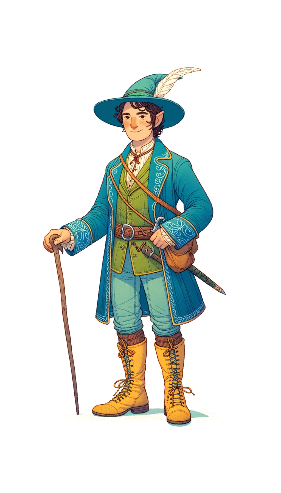

### Batch 1 - Dalle

#### 001-tom-2680940717-1

```
Cell shade animation illustration;
Portrait, full body view of a 32 year old man with light brown skin, an oval face, and a dimple on his left cheek against a white blank background;
Neutral lighting;
He stands upright, holding a walking stick in his left hand and his right hand in his pocket;
The color palette is vibrant pastel;
He's adorned in a velvet bright blue jacket with silver embroidery on the cuffs, a woven green girdle, and soft leather breeches with stitched patterns;
On his feet are bright yellow hiking boots with worn soles;
A short sword is sheathed in brown leather on his left waist;
He dons a forest green tall pointy hat without a buckle but with a brown band, and it's decorated with a long white swan feather tucked in the band;
The perspective is a straight-on frontal view.
```

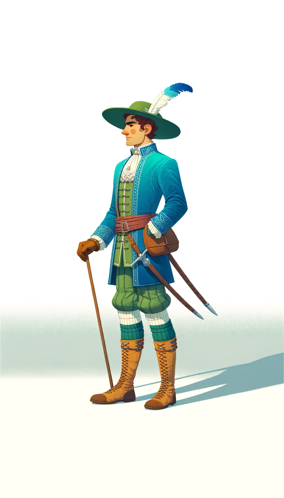

#### 002-tom-2668347371-1

```
Cell shade animation illustration;
Full body portrait on a white background;
Neutral lighting casts no shadows;
A man named Tom Bombadil, 32 years old, with light brown skin, oval face, and a dimple on his left cheek stands confidently;
He wears a vibrant pastel-colored outfit consisting of a bright blue velvet jacket with silver embroidery, a green woven girdle, and patterned leather breeches;
His yellow hiking boots show signs of wear on the soles;
With his left hand, he grips a walking stick, while his right hand rests in his pocket;
A brown leather-sheathed short sword hangs on his left;
His attire is completed with a tall, pointy, forest green hat, adorned with a white swan feather;
Viewed directly from the front.
```

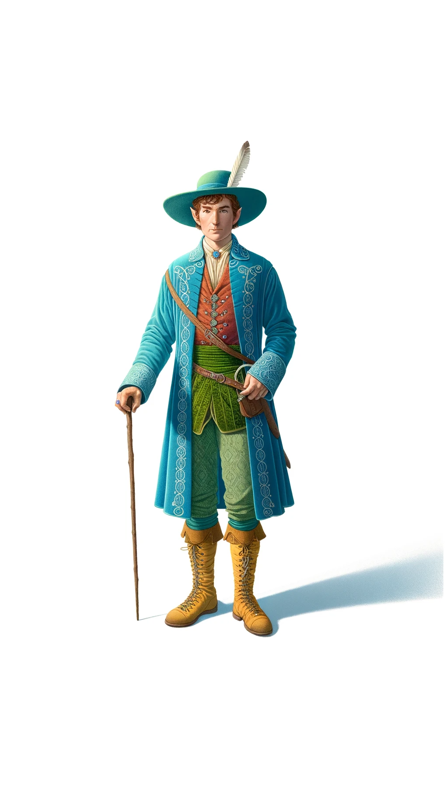

#### 003-tom-1427215897-1

```
Animation-style cell shade illustration;
Depicting a man named Tom Bombadil, 32 years old, with light brown skin, in full body view;
Set against a pure white backdrop with even lighting;
He stands tall, with a walking stick in his left hand and right hand in pocket;
His attire is colorful, wearing a bright blue velvet jacket with intricate silver embroideries, a green girdle, leather breeches with unique stitched patterns, and bright yellow, worn-soled hiking boots;
A short sword is attached to his left waist inside a brown leather sheath;
His head is crowned with a distinctive forest green pointy hat, devoid of a buckle but with a brown band, and accentuated with a long white feather from a swan;
The whole scene is captured from a straight, head-on angle.
```

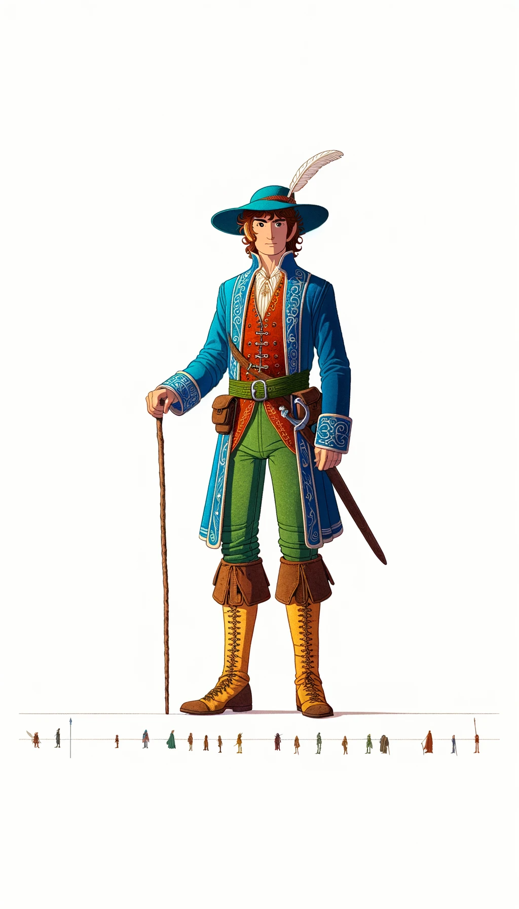

#### 004-tom-411892750-1

```
Illustration in cell shade animation style;
On a white, unblemished background, a man named Tom Bombadil, aged 32 with light brown skin, stands in full body view;
The light is neutral, creating no dramatic shadows;
Tom's attire is vibrant, wearing a jacket of bright blue velvet with silver designs on the cuffs, a green belt, and leather breeches decorated with stitched patterns;
His yellow boots, though bright, show wear on the soles;
He holds a walking stick with his left hand, while a short sword in a brown sheath is on his left waist;
His headgear is a tall green hat, pointy at the top, with a brown band and a white swan feather as an accessory;
The perspective is direct and frontal.
```

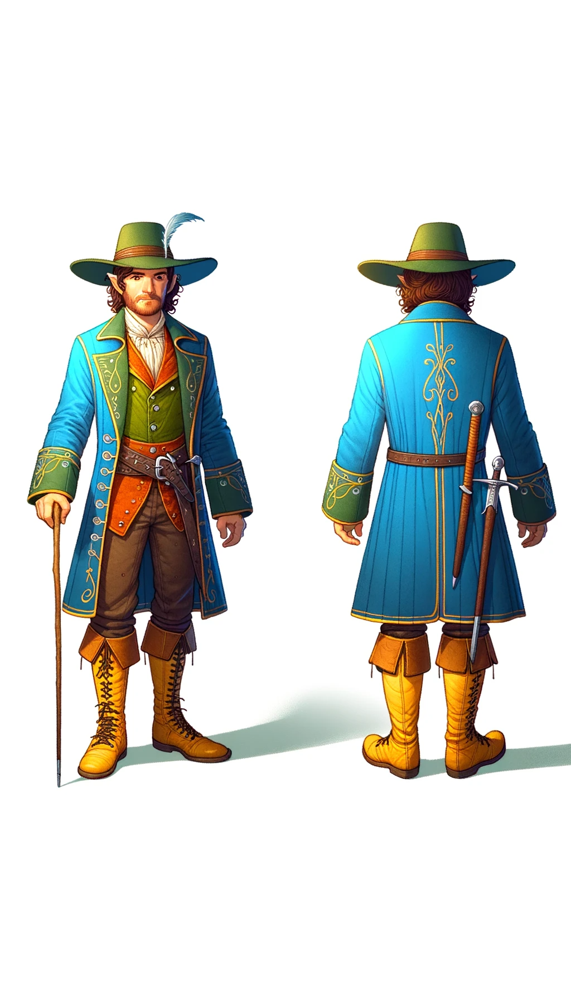

## Prompt 02

```
Cell shade animation illustration ;
Portrait, centered full body view, one character. ;
White blank background. ;
neutral light. ;
Tom Bombadil is a 32 year old man, light brown skin, an oval face, and a dimple on his left cheek. ;
Tom Bombadil is standing up straight, holding a walking stick with his left hand, and his right in his pocket. ;
Vibrant pastel colors. ;
He has a prominent long white curly bushy beard (goes down to his chest). ;
He has white short curly hair on his head with a slight wave. ;
He's hazel eyes twinkle with mischief, and he has round ears. ;
He Bombadil has a slim build with broad shoulders. ;
He wears a velvet bright blue jacket, with silver embroidery on the cuffs, a woven green girdle, and soft leather breeches with stitched patterns ; 
He is wearing bright yellow hiking boots, with worn soles. ;
Tom has a short sword on the left side of his waiste, it is sheathed in brown leather. :
Tom is wearing a forest green tall pointy hat (no buckle, brown band, adorned with a long white swan feather tucked in band). ;
Straight-on frontal view of Tom, facing the camera
```

### Seeds

- **seed:** `3931875023`
- **temperature:** `1.0`

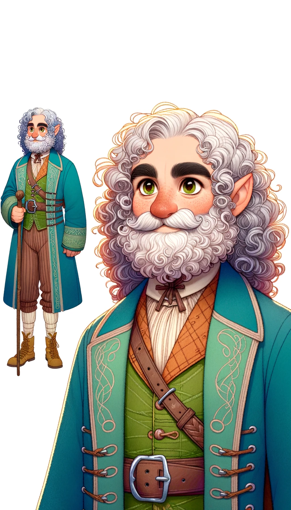

- **seed:**  `19719203`
- **temperature:** `1.0`

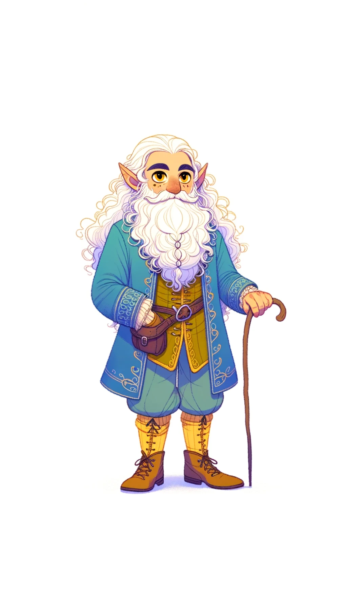

- **seed:**  `4191410927`
- **temperature:** `1.0`

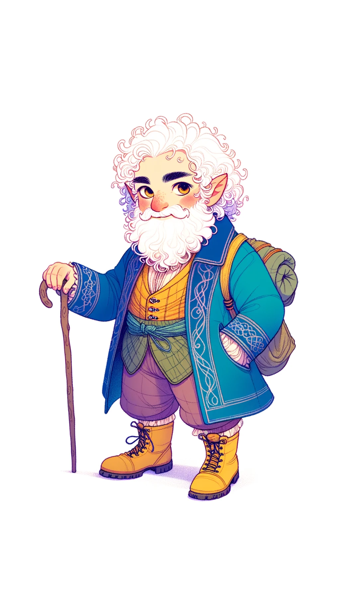

- **seed:**  `2945574601`
- **temperature:** `1.0`

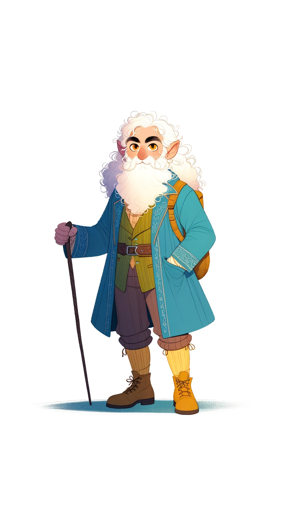

- **temperature:** `0`


- **temperature:** `0.4`


- **temperature:** `0.8`


- **temperature:** `0.99`

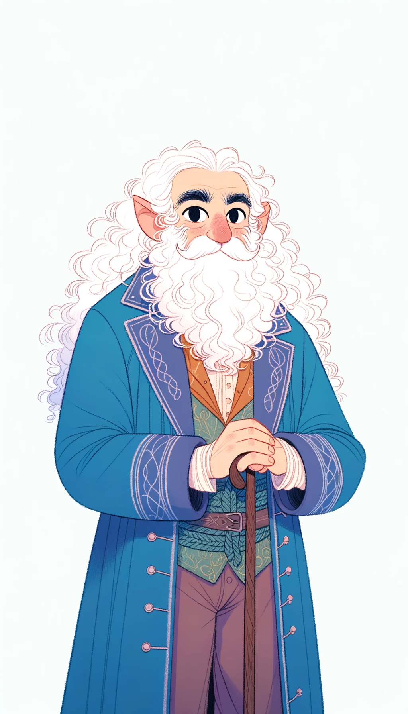

- **temperature:** `1.0`


### Batch 2 - Dalle

#### 005-tom-3894164056-1

```
Cell shade animation illustration;
Centered full body portrait of a 32 year old man named Tom Bombadil with light brown skin, an oval face, a dimple on his left cheek, and hazel eyes that twinkle with mischief set against a white blank background;
Neutral lighting;
He stands upright, holding a walking stick in his left hand and the other in his pocket;
The color palette is vibrant pastel;
He sports a prominent long white curly bushy beard that reaches his chest and has white short curly hair with a slight wave on his head;
Tom has round ears and a slim build with broad shoulders;
He's dressed in a bright blue velvet jacket with silver embroidery on the cuffs, a woven green girdle, and soft leather breeches with stitched patterns;
His bright yellow hiking boots have worn soles;
A short sword is sheathed in brown leather on his left waist;
Tom wears a tall forest green pointy hat, without a buckle but with a brown band, adorned with a long white swan feather;
The view is straight-on, with Tom facing the camera.
```

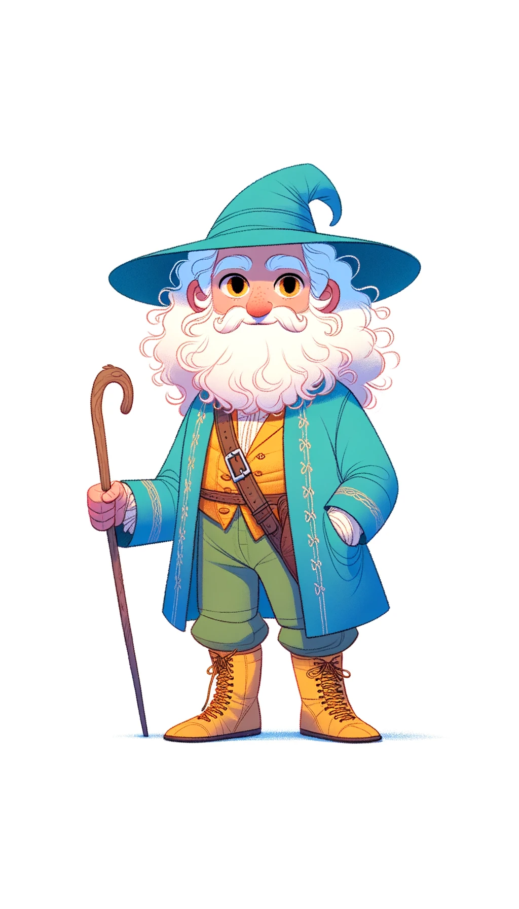

#### 006-tom-696603144-1

```
Animation-style cell shade illustration;
Tom Bombadil, a 32 year old man with light brown skin, stands confidently in a full body centered portrait against a pure white background;
The lighting is neutral;
His facial features include an oval face, a left cheek dimple, mischievous hazel eyes, round ears, a prominent long white curly beard that goes down to his chest, and white short curly hair with a wave;
His physique is slim with broad shoulders;
Tom's vibrant pastel-colored attire comprises a bright blue velvet jacket with silver cuffs embroidery, a green woven girdle, patterned leather breeches, and bright yellow worn-soled hiking boots;
On his left waist, there's a brown leather sheathed short sword;
His look is completed with a tall, pointy forest green hat with a brown band and a white swan feather;
The perspective is direct and frontal with Tom looking at the camera.
```

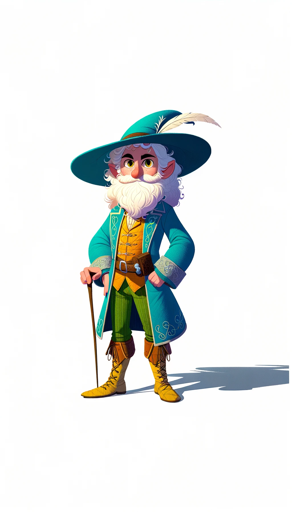

#### 007-tom-3350872452-1

```
Illustration in cell shade animation style;
Tom Bombadil, aged 32 with light brown skin, is depicted in a centered full body portrait on a white backdrop;
The scene is lit neutrally;
He has an oval face, a dimple on his left cheek, twinkling hazel eyes full of mischief, round ears, white short curly wavy hair, and a long white curly bushy beard that descends to his chest;
His build is slim yet with broad shoulders;
In terms of attire, he dons a bright blue velvet jacket with intricate silver embroideries on the cuffs, a green girdle, and leather breeches with unique stitched designs;
His yellow boots, though vibrant, show signs of wear;
In his left hand, he holds a walking stick, and a short sword in a brown leather sheath hangs on his left side;
Crowning his head is a tall pointy forest green hat, accentuated with a brown band and a white swan feather;
The whole depiction is from a straight, head-on angle, with Tom facing forward.
```

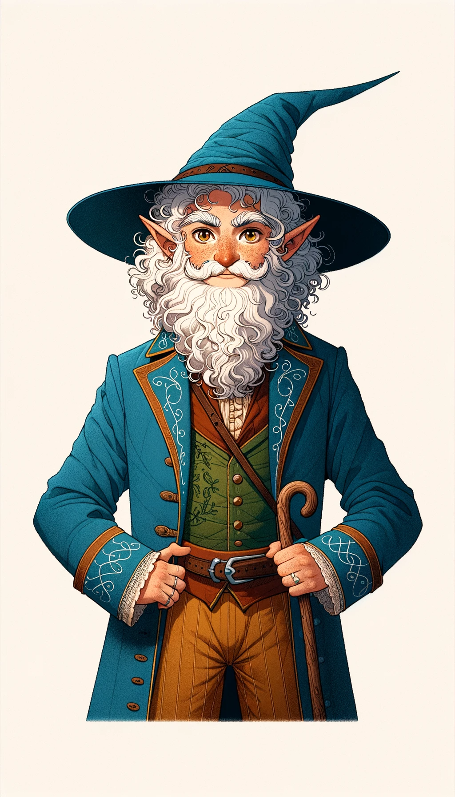

#### 008-tom-1901813199-1

```
Cell shade animation portrayal;
On a pristine white background, Tom Bombadil, a 32-year-old man with light brown skin, is presented in a centered full body view;
Neutral lighting illuminates the scene;
His facial features comprise an oval face, a dimple on the left cheek, round ears, and hazel eyes gleaming with playfulness;
He boasts a bushy white curly beard that extends to his chest and is complemented by white curly short hair with a hint of waviness;
Tom's physique is described as slim but with pronounced broad shoulders;
Dressed in pastel hues, he wears a jacket of bright blue velvet with silver designs on the cuffs, a green belt, and decorative leather breeches;
Bright yellow hiking boots with evident wear grace his feet;
He grasps a walking stick in his left hand, and on the same side, a short sword is tucked into a brown sheath;
His green tall hat, pointing upwards, is devoid of buckles but features a brown band, embellished with a long white feather;
The depiction offers a straight and direct frontal view.
```

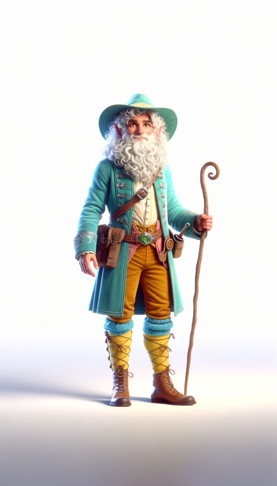

