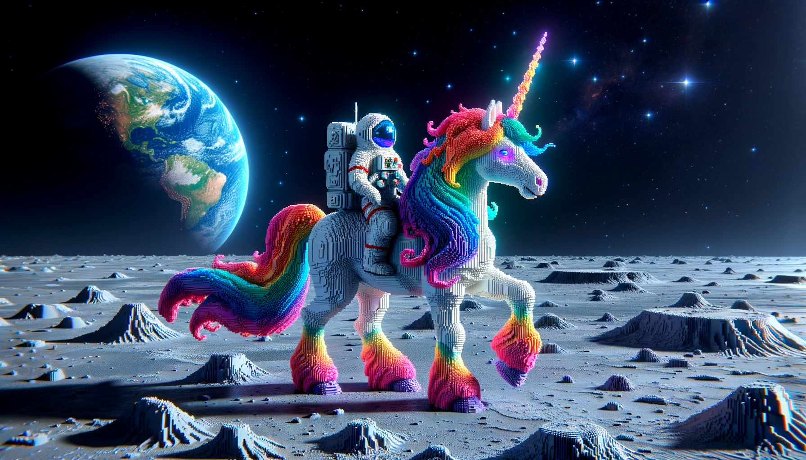

# Wolfunicorn 

```
Intricate Voxel Rendering | Landscape orientation | A majestic blue wolf stands prominently in the center of a mystical forest clearing | The wolf's deep blue fur shimmers, reflecting the faint moonlight that pierces through the dense canopy above | Its eyes, a brighter shade of blue, exude wisdom and power | What sets this wolf apart from any ordinary wolf is its multitude of flowing tails, each tail moving with its own unique rhythm, creating an almost hypnotic dance | The tails are long, fluffy, and seem to be imbued with magic, leaving a trail of sparkles in their wake | The forest around the wolf is serene, with tall ancient trees, bioluminescent plants, and a carpet of soft moss covering the ground | Fireflies dance around, adding to the magical atmosphere | The viewer feels a sense of awe and wonder, captivated by the beauty and mystery of the blue multi-tailed wolf.
```


```
Intricate Voxel Rendering | Landscape orientation | A majestic black wolf stands prominently in the center of a mystical forest clearing | The wolf's deep black fur absorbs the faint moonlight that pierces through the dense canopy above | Its eyes, a bright glowing yellow, exude an intense and powerful aura | This wolf, with its multitude of flowing tails, each tail moving with its own unique rhythm, creates a captivating presence | The forest around the wolf is serene, with tall ancient trees, bioluminescent plants, and a carpet of soft moss covering the ground | Fireflies dance around, adding to the magical atmosphere | The viewer feels a sense of awe and wonder, entranced by the beauty and mystery of the black multi-tailed wolf with glowing eyes.
```


```
Intricate Voxel Rendering | Landscape orientation | A majestic white wolf stands prominently in the center of a mystical forest clearing | The wolf's pristine white fur reflects the faint moonlight that pierces through the dense canopy above | Its eyes, a bright glowing yellow, exude an intense and powerful aura | This wolf, with its multitude of flowing tails, each tail moving with its own unique rhythm, creates a captivating presence | The forest around the wolf is serene, with tall ancient trees, bioluminescent plants, and a carpet of soft moss covering the ground | Fireflies dance around, adding to the magical atmosphere | The viewer feels a sense of awe and wonder, entranced by the beauty and mystery of the white multi-tailed wolf with glowing eyes.
```


```
Intricate Voxel Rendering | Landscape orientation | A majestic white wolf stands prominently in the center of a mystical forest clearing with a mysterious rider on its back | The rider, cloaked in a hooded garment, seems to be in harmony with the wolf | The wolf's pristine white fur reflects the faint moonlight that pierces through the dense canopy above | Its eyes, a bright glowing yellow, exude an intense and powerful aura | This wolf, with its multitude of flowing tails, each tail moving with its own unique rhythm, creates a captivating presence | The forest around the wolf and its rider is serene, with tall ancient trees, bioluminescent plants, and a carpet of soft moss covering the ground | Fireflies dance around, adding to the magical atmosphere | The viewer feels a sense of awe and wonder, entranced by the beauty and mystery of the white multi-tailed wolf with its enigmatic rider.
```


```
Intricate Voxel Rendering | Landscape orientation | A majestic white wolf stands prominently in the center of a mystical forest clearing during daytime with a mysterious rider on its back | The rider, cloaked in a hooded garment, seems to be in harmony with the wolf | The wolf's pristine white fur contrasts beautifully with the vibrant greenery around | Its eyes, a deep shade of amber, exude a calm and powerful aura | This wolf, with its multitude of flowing tails, each tail moving with its own unique rhythm, creates a captivating presence | The forest around the wolf and its rider is illuminated by the bright sunlight, with tall ancient trees, lush plants, and a carpet of soft moss covering the ground | Birds can be heard chirping, adding to the serene atmosphere | The viewer feels a sense of peace and wonder, captivated by the beauty and harmony of the white multi-tailed wolf with its enigmatic rider.
```


```
Intricate Voxel Rendering | Landscape orientation | A majestic white wolf stands prominently in the center of a mystical forest clearing during autumn with a mysterious rider on its back | The rider, cloaked in a hooded garment, seems to be in harmony with the wolf | The wolf's pristine white fur contrasts beautifully with the golden hues of falling leaves around | Its eyes, a deep shade of amber, exude a calm and powerful aura | This wolf, with its multitude of flowing tails, each tail moving with its own unique rhythm, creates a captivating presence | The forest around the wolf and its rider is painted in warm autumn colors, with tall ancient trees shedding their leaves, and a carpet of soft moss covering the ground interspersed with fallen leaves | The sound of rustling leaves adds to the serene atmosphere | The viewer feels a sense of nostalgia and wonder, captivated by the beauty of the white multi-tailed wolf with its enigmatic rider amidst the autumn landscape.
```


```
Intricate Voxel Rendering | Landscape orientation | A majestic white wolf stands prominently in the center of a mystical forest clearing during autumn with a samurai rider on its back | The samurai, adorned in traditional armor and wielding a katana, seems to be in harmony with the wolf | The wolf's pristine white fur contrasts beautifully with the golden hues of falling leaves around | Its eyes, a deep shade of amber, exude a calm and powerful aura | This wolf, with its multitude of flowing tails, each tail moving with its own unique rhythm, creates a captivating presence | The forest around the wolf and its samurai rider is painted in warm autumn colors, with tall ancient trees shedding their leaves, and a carpet of soft moss covering the ground interspersed with fallen leaves | The sound of rustling leaves and the distant echo of a bamboo flute add to the serene and warrior-like atmosphere | The viewer feels a sense of honor, nostalgia, and wonder, captivated by the beauty of the white multi-tailed wolf with its samurai rider amidst the autumn landscape.
```


```
Intricate Voxel Rendering | Landscape orientation | A majestic white wolf stands prominently in the center of a mystical forest clearing during spring with a samurai rider on its back | The samurai, adorned in traditional armor and wielding a katana, seems to be in harmony with the wolf | The wolf's pristine white fur contrasts beautifully with the fresh green hues of budding leaves and blooming flowers around | Its eyes, a deep shade of amber, exude a calm and powerful aura | This wolf, with its multitude of flowing tails, each tail moving with its own unique rhythm, creates a captivating presence | The forest around the wolf and its samurai rider is painted in vibrant spring colors, with tall ancient trees showing new growth, and a carpet of soft moss covering the ground interspersed with blooming wildflowers | The sound of chirping birds and the distant echo of a bamboo flute add to the serene and warrior-like atmosphere | The viewer feels a sense of renewal, honor, and wonder, captivated by the beauty of the white multi-tailed wolf with its samurai rider amidst the spring landscape.
```


```
Intricate Voxel Rendering | Landscape orientation | A majestic white wolf stands prominently in the center of a mystical forest clearing during cherry blossom season with a samurai rider on its back | The samurai, adorned in traditional armor and wielding a katana, seems to be in harmony with the wolf | The wolf's pristine white fur contrasts beautifully with the pink hues of cherry blossoms around | Its eyes, a deep shade of amber, exude a calm and powerful aura | This wolf, with its multitude of flowing tails, each tail moving with its own unique rhythm, creates a captivating presence | The forest around the wolf and its samurai rider is painted with cherry blossom trees in full bloom, their petals gently falling to the ground, creating a soft pink carpet | The sound of chirping birds and the distant echo of a bamboo flute add to the serene and warrior-like atmosphere | The viewer feels a sense of renewal, honor, and wonder, captivated by the beauty of the white multi-tailed wolf with its samurai rider amidst the cherry blossoms.
```


```
Intricate Voxel Rendering | Landscape orientation | A majestic gray wolf stands prominently in the center of a mystical forest clearing during cherry blossom season with a samurai rider on its back | The samurai, adorned in traditional armor and wielding a katana, seems to be in harmony with the wolf | The wolf's sleek gray fur contrasts beautifully with the pink hues of cherry blossoms around | Its eyes, a deep shade of amber, exude a calm and powerful aura | This wolf, with its multitude of flowing tails, each tail moving with its own unique rhythm, creates a captivating presence | The forest around the wolf and its samurai rider is painted with cherry blossom trees in full bloom, their petals gently falling to the ground, creating a soft pink carpet | The sound of chirping birds and the distant echo of a bamboo flute add to the serene and warrior-like atmosphere | The viewer feels a sense of renewal, honor, and wonder, captivated by the beauty of the gray multi-tailed wolf with its samurai rider amidst the cherry blossoms.
```


```
Intricate Voxel Rendering | Landscape orientation | A majestic gray wolf stands prominently in the center of a mystical forest clearing during cherry blossom season with a spaceman rider on its back | The spaceman, adorned in a modern space suit and helmet, seems to be in harmony with the wolf, juxtaposing the ancient and the futuristic | The wolf's sleek gray fur contrasts beautifully with the pink hues of cherry blossoms around | Its eyes, a deep shade of amber, exude a calm and powerful aura | This wolf, with its multitude of flowing tails, each tail moving with its own unique rhythm, creates a captivating presence | The forest around the wolf and its spaceman rider is painted with cherry blossom trees in full bloom, their petals gently falling to the ground, creating a soft pink carpet | The sound of chirping birds and the distant hum of space technologies blend in the serene and otherworldly atmosphere | The viewer feels a sense of wonder, captivated by the beauty of the gray multi-tailed wolf with its spaceman rider amidst the cherry blossoms.
```


```
Intricate Voxel Rendering | Landscape orientation | A majestic gray wolf stands prominently on the surface of the moon with a spaceman rider on its back | The barren, crater-filled lunar surface stretches out around them, with Earth visible in the distant sky | The spaceman, adorned in a modern space suit and helmet, seems to be in harmony with the wolf | The wolf's sleek gray fur contrasts beautifully with the gray and white hues of the moon's surface | Its eyes, a deep shade of amber, exude a calm and powerful aura | This wolf, with its multitude of flowing tails, each tail moving with its own unique rhythm, creates a captivating presence in the lunar environment | Stars twinkle brightly in the vastness of space, and the distant Earth glows with a beautiful blue hue | The silence of space envelops the scene, creating a serene and otherworldly atmosphere | The viewer feels a sense of wonder, captivated by the beauty of the gray multi-tailed wolf with its spaceman rider on the moon.
```


```
Intricate Voxel Rendering | Landscape orientation | A majestic unicorn stands prominently on the surface of the moon with a spaceman rider on its back | The barren, crater-filled lunar surface stretches out around them, with Earth visible in the distant sky | The spaceman, adorned in a modern space suit and helmet, seems to be in harmony with the unicorn | The unicorn's sleek white fur and shimmering horn contrast beautifully with the gray and white hues of the moon's surface | Its eyes, a deep shade of blue, exude a calm and magical aura | The unicorn, with its flowing mane and tail, creates a captivating presence in the lunar environment | Stars twinkle brightly in the vastness of space, and the distant Earth glows with a beautiful blue hue | The silence of space envelops the scene, creating a serene and otherworldly atmosphere | The viewer feels a sense of wonder, captivated by the beauty of the unicorn with its spaceman rider on the moon.
```


```
Intricate Voxel Rendering | Landscape orientation | A majestic multicolored unicorn stands prominently on the surface of the moon with a spaceman rider on its back | The barren, crater-filled lunar surface stretches out around them, with Earth visible in the distant sky | The spaceman, adorned in a modern space suit and helmet, seems to be in harmony with the unicorn | The unicorn's vibrant shades of fur and a shimmering horn create a stunning visual contrast with the gray and white hues of the moon's surface | Its eyes, reflecting a spectrum of colors, exude a magical aura | The unicorn, with its flowing mane and tail displaying a myriad of colors, creates a captivating presence in the lunar environment | Stars twinkle brightly in the vastness of space, and the distant Earth glows with a beautiful blue hue | The silence of space envelops the scene, creating a serene and otherworldly atmosphere | The viewer is entranced by the beauty of the multicolored unicorn with its spaceman rider on the moon.
```


> temperature `0`


> temperature `1`


> temperature `1.0`




---

**message:** `try the previous image again with the same prompt, seed, and temperature of 1.0`

```
Intricate Voxel Rendering | Landscape orientation | Panoramic view of a barren landscape on the moon | A spaceman rides a multicolored unicorn | The spaceman is wearing a classic astronaut suit with a gold visor | The unicorn has a twisted horn and a flowing mane | Stars and distant galaxies are visible in the background.
```


**message:** `repeate` 😅 I hope that's the British spelling

```
Intricate Voxel Rendering | Landscape orientation | Panoramic view of a barren landscape on the moon | A spaceman rides a multicolored unicorn | The spaceman is wearing a classic astronaut suit with a gold visor | The unicorn has a twisted horn and a flowing mane | Stars and distant galaxies are visible in the background.
```


**message:** `repeat`


**message:** `try the previous image with a different seed and a temperature of 0`

```
Intricate Voxel Rendering | Landscape orientation | Panoramic view of a moon-like landscape | A spaceman rides on the back of a multicolored unicorn | The spaceman wears a shiny silver suit and holds a flag with a unique emblem | The unicorn has a shimmering mane and tail | Large craters are visible on the ground, and stars twinkle in the pitch-black sky.
```


> Looks like it didn't retain the prompts 😭

**message:** `try the previous image with the seed incremented by 1 and a temperature of 0`

```
Intricate Voxel Rendering | Landscape orientation | Panoramic view of a space-themed landscape with craters and distant galaxies | A slender planet rises in the dark star-filled sky | A group of 4 astronauts are exploring the terrain | In the distance, a multicolored unicorn stands majestically atop a hill | Dark, gloomy hues dominate the scene but are punctuated by the bright lights of distant stars and planets | The lead astronaut is pointing towards the unicorn while the others seem to be in awe | All astronauts wear typical space suits, but each has a unique emblem that sets them apart | The unicorn has a long spiral horn and its mane seems to shimmer with the colors of the galaxy | The viewer observes the scene from a slight elevation, capturing the astronauts and the unicorn in the foreground, and the vastness of space in the background.
```


**message:** `same image, seed, and temperature 0 make the unicorn a hybrid of a wolf`

```
Intricate Voxel Rendering | Landscape orientation | On the moon's surface with craters and a view of the Earth in the distant sky | A spaceman riding on a hybrid creature that's a mix of a unicorn and a wolf | The creature has the majestic horn and mane of a unicorn but the body and posture of a wolf | Both the spaceman and the creature cast long shadows on the moon's surface due to the bright light from the Earth | The spaceman is holding onto the creature's mane as they appear to be in motion, exploring the moon's terrain | The atmosphere is serene and mysterious.
```


```
Intricate Voxel Rendering | Landscape orientation | Panoramic view of the moon's surface with craters and a distant Earth visible in the sky | A spaceman rides on a hybrid creature that combines elements of both a unicorn and a wolf | The spaceman is equipped with futuristic space gear and holds a flag | The hybrid creature has the majestic horn of a unicorn and the fierce features of a wolf | The overall atmosphere is mysterious and otherworldly.
```


